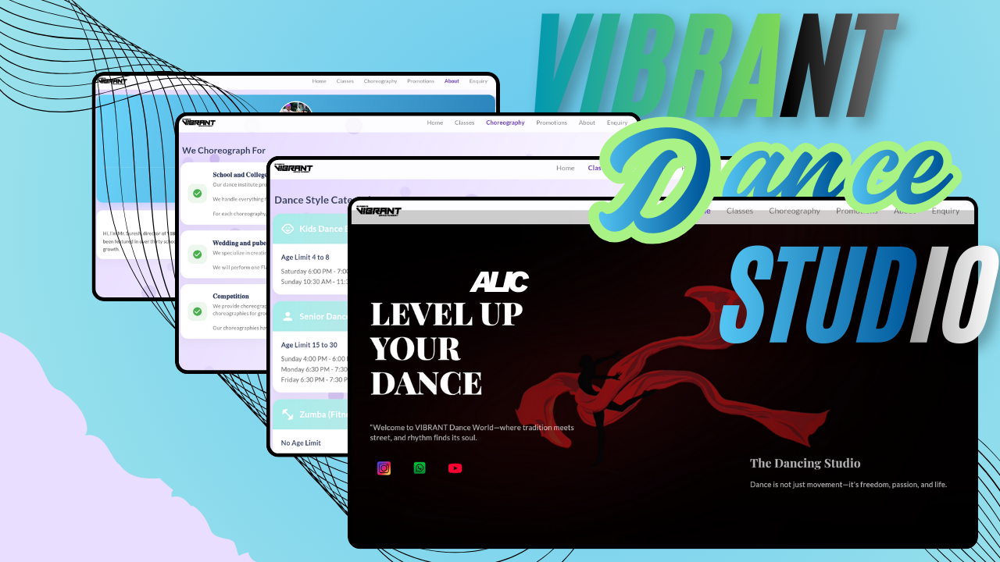

# 💃 Vibrant Dance Academy
### *The Ultimate Professional Dance Studio Management Platform*

  

---

## 🔗 Quick Links
| 🌐 Live Demo | 🚀 Deployment | 🛠 Project Status |
| :--- | :--- | :--- |
| [**Visit Website**](https://syed2006-hub.github.io/vibrant_dance_academy/) | **GitHub Pages** | **✅ Production Ready** |

---

## 🚀 **Overview**
**Vibrant Dance Academy** is a comprehensive web solution tailored for modern dance studios. It combines a **premium student-facing interface** with a **powerful backend Admin CMS**, allowing studio owners to manage their entire digital presence without writing a single line of code.

---

## ✨ **Key Features**

### 🏫 **Studio Management**
* **Brand Identity:** Comprehensive "About Us" and Philosophy sections.
* **Curriculum Showcase:** Display various **Dance Styles** with high-quality descriptions.
* **Class Schedules:** Detailed choreography and class management for students and parents.

### 🛠 **Dynamic Admin Panel**
* **Full CRUD Control:** Create, Edit, and Delete Classes, Styles, and Content on the fly.
* **No-Code Updates:** Instantly update the website content via the admin dashboard.
* **Real-time Management:** Changes reflect instantly on the frontend.

### 📝 **Enquiry & Lead System**
* **Integrated Forms:** Capture student enquiries directly from the landing page.
* **Admin Inbox:** View all user enquiries in a centralized dashboard.
* **Direct Response:** Contact users instantly via **WhatsApp** or **Email** with one click.

### 📞 **Interactive Engagement**
* **Social Connectivity:** Deep integration with studio social media profiles.
* **Seamless Communication:** Optimized for high conversion and student interaction.

---

## 🛠 **Tech Stack**

| Category | Technology |
| :--- | :--- |
| **Frontend** | Modern Web Technologies (React/Next.js Architecture) |
| **Styling** | Advanced Tailwind CSS / Responsive Design |
| **Admin System** | Custom CMS Architecture |
| **Handling** | Advanced Form Data Management |

---

## 🎯 **Ideal Use Cases**
* 💃 **Dance Academies** seeking a professional online presence.
* 🎓 **Training Institutes** needing structured course management.
* 🏢 **Studio Owners** wanting to automate lead management.
* 📈 **Entrepreneurs** building client enquiry handling systems.

---

## 📈 **Project Status**
> **Current Status:** ✅ **Production Ready** > **Impact:** Currently used for real-world studio interaction and management.

---

  Made with ❤️ by <b>Syed</b>

